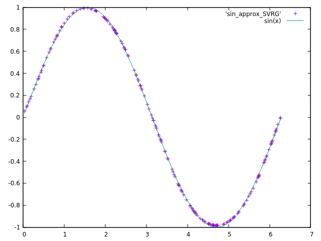

# Implementing SVRG for neural networks
Following our exploration of variants of SGD algorithm (check our previous analysis of [SAGA](https://github.com/Djeeb/stage_DL/tree/master/projects_pytorch/SAGA_nnet) algorithm),
we decided to dig into the promising **Stochastic Variance Reduced Gradient** algorithm from [R. Johnson et al., 2013](https://papers.nips.cc/paper/4937-accelerating-stochastic-gradient-descent-using-predictive-variance-reduction.pdf).
It is directly inspired from SDCA and SAG, but unlike SAG, it doesn't involve full gradients storage. Researchers say it is actually easily applicable for neural network learning.
We want to compare convergence rate to SGD algorithm on several neural network structures and learning tasks. 
You can check the whole implementation in `SVRG.hpp`.

- **I- [ Intuition behind SVRG ](#intuition)**
	- 1- [What is SVRG ?](#abstract)
	- 2- [Reducing variance while keeping the same expectation](#variance)

- **II- [ Implementing SVRG on libtorch ](#implementing)**
	- 1- [Algorithm ](#algorithm)
	- 2- [How to compute and store the gradient of W tilde ?](#gradient)
	- 3- [Warm start implementation](#warm)
	
- **III- [ Numerical application ](#numerical)**
	- 1- [Approximation of sin(x) ](#sin)
	- 2- [Neural network on MNIST classification task](#MNIST)
	
- **III- [ Conclusion ](#conclusion)**

<a name="intuition"></a>
## I- Intuition behind SVRG

<a name="abstract"></a>
### 1- What is SVRG ?

The idea behind SVRG is to reduce the variance induced by SDG. Indeed, if SGD algorithm converges to classical gradient descent in expectation, 
the variance of random sampling make the convergence rate much lower, as we have to choose a small learning rate or make it decrease at each iteration.The solution proposed by SVRG is to use a fixed and larger learning rate in the spirit of SAG ([Le Roux et al., 2012](https://arxiv.org/pdf/1202.6258.pdf)) without using any gradients storage.
In addition, the convergence theories behind SVRG work even in a nonconvex learning task. Thus, it is specially designed for neural networks.

The idea is simple : at each m * n step, we keep the parameter W in memory. For the next m * n steps, we also compute its gradient (in addition to the real parameter's one) to add stabilization during the update task. 
This W kept in memory is called a "snapshot" and is denoted by W tilde. Here is a drawing of how the SVRG algorithm roughly works compared to SGD : 


As usual, we denote the gradient of J w.r.t a parameter W at iteration (k) on the ith sample by : 


As we said, W tilde denotes a *snapshot* of the parameter i.e. a copy of W taken at a certain iteration s.  It will be used in the algorithm to reduce the impact
of the variance  Typically, this W tilde is updated every 2n or 5n (n = number of samples in the dataset) :


The only thing we will need from this variable is the gradient of J (regarding a certain individual i) w.r.t W tilde  : 


In addition, each time W tilde is updated, we compute the classical gradient of the dataset (i.e. the average of all the individual gradients). It will be also used
in the SVRG algorithm to increase stability :


At iteration (k), **SVRG** consists in picking an index i randomly among the n samples and update the parameter W as follows : 

 

<a name="variance"></a>
### 2- Reducing variance while keeping the same expectation

Our general learning problem is still defined as a minimization of a cost function J regarding some parameters materialized by W. In our case, these parameters are the
weights and biases of our neural network. Generally, the cost function is an average of loss functions that only differ by the input, i.e. the individual i of the 
dataset :


The most classical method to numerically minimize this function is the **standard gradient descent** algorithm. At iteration k, we compute the average of gradients 
w.r.t W regarding the dataset and update the weight consequently with a small pace alpha :


The problem of this method is that each update is very computationally **expensive** as it requires to calculate n gradients. Therefore, **Stochastic Gradient 
Descent** (SGD) was a way to reduce this cost by updating the weight with only one gradient calculated on a individual i randomly picked :


With this method, updates are computed with only one gradient calculation instead of n.
This popular methode was mathematically justified by the fact that the expectation of W at k knowing W at k-1 is identical. As it is not a stochastic method, for the classical
gradient descent we have obviously :


And for SGD, index *i* can be seen as a random variable following a uniform distribution, and then :


However, some variance is introduced with SGD. Indeed, remembering the general formula of conditional variance


Therefore, we have in SGD case : 


Yet :


And finally we obtain the variance of W for SGD case : 


After thousands of iterations with SGD, this variance is not optimal as we need to be "more accurate" when we update W. Thus, the only way to reduce variance is to reduce alpha 
consequently, at the cost of a slower descent. 

But what if we try to reduce the other term of the variance, i.e. reshaping the gradient update algorithm ? As we have seen before, SVRG algorithm is introducing 2 other terms to
stabilize variance :

 

The expectation is the same as for SGD and standard gradient : 


<a name="implementing"></a>
## II- Implementing SVRG on libtorch

<a name="algorithm"></a>
### 1- Algorithm

SVRG algorithm requires to compute 2 parameters : the *snapshot* one, and the real one. The snapshot one, denoted by W tilde, must be updated each m*n iterations. 

________________________________________


________________________________________

<a name="gradient"></a>
### 2- How to compute and store the gradient of W tilde ?

What is complicated with SVRG is to store a snapshot of W every `m*n` iterations (we tried with `m=2` and `m=5` as suggested in the paper) in order to compute the gradient of an individual i at each iteration.
We also have to compute the average of gradients w.r.t W tilde whenever it changes. 

Imagine we have a neural network with 2 activation functions. We want to be able to compute both "real" parameters gradients and also "snapshots" gradients at each iteration. Here is a drawing of what we want to implement in c++ : 


Our strategy will consist in :

- 1. computing a forward / back propagation with snapshot parameters and store dWi, **without updating any weight**.
- 2. computing a forward / back propagation with real parameters and update them with SVRG method thanks to mu and dWi.
	

#### **Initialization**

We decided to materialize the snapshot activation functions by two additional `torch::nn::Linear` modules, which can be seen as "copies at time t" of real activation functions.
We use a custom method `set_snapshot` to reinitialize snapshot weights and mu respectively to the real parameters and 0 whenever we need :

```c++
//Snapshot activation functions initialization
z1_snapshot = register_module("z1_snapshot", torch::nn::Linear(n_input,n_hidden));
z2_snapshot = register_module("z2_snapshot", torch::nn::Linear(n_hidden,n_output));

//Initializating mu and snapshots
mu.resize(4);
this->set_snapshot();
```
Note that we get access to the parameter i through the syntax `.parameters()[i]`. W1 is is the first slot, b1 in the second, etc. W1_snapshot is in the fifth slot, b1_snapshot in the sixth, etc.
We also decided to store mu in a vector of tensors of size 4. 
Therefore here is the `set_snapshot` method that will be useful each time we end the 5 passes through the dataset :

```c++
void nnet::set_snapshot(){
	
//set snapshot to the most recent value of W
for(int i=0;i<4;i++){
	this->parameters()[i+4].set_data( this->parameters()[i].clone() );
}	
//reinitialize mu
mu[0] = torch::zeros({this->parameters()[0].size(0),this->parameters()[0].size(1)}).to(options_double);
mu[1] = torch::zeros({this->parameters()[1].size(0)}).to(options_double);
mu[2] = torch::zeros({this->parameters()[2].size(0),this->parameters()[2].size(1)}).to(options_double);
mu[3] = torch::zeros({this->parameters()[3].size(0)}).to(options_double);
	
}
```

#### **Compute the average of gradients**

In order to compute the average of gradients w.r.t the snapshot W tilde, we use a simple update method that will be triggered every m*n iterations, during 1 epoch :

```c++
void nnet::update_mu(){

for(int i=0;i<4;i++){
	mu[i] += this->parameters()[i+4].grad().clone() / double(training_size);
}

}
```

#### **Forward propagation**

We have to duplicate the forward propagation method in order to compute both gradients w.r.t real and snapshot parameters. 

Here is the 'real' forward :

```c++
torch::Tensor nnet::forward( torch::Tensor & X ){	
	X = z1->forward(X);
	X = torch::sigmoid(X);
	X = z2->forward(X);
	X = torch::softmax(X,1);
		
	return X;
}
```

Here is the 'snapshot' forward :

```c++
torch::Tensor nnet::forward_snapshot( torch::Tensor & X ){	
	X = z1_snapshot->forward(X);
	X = torch::sigmoid(X);
	X = z2_snapshot->forward(X);
	X = torch::softmax(X,1);
		
	return X;
}
```

#### **Update**

Update method for SVRG is quite simple as far as we gathered all the values before :

```c++
void nnet::update_SVRG(){
for(int i=0;i<4;i++){
	this->parameters()[i].set_data(this->parameters()[i].clone() - learning_rate * ( this->parameters()[i].grad().clone() - this->parameters()[i+4].grad().clone() + mu[i] ) );
}	
}
```


#### **Cost computing**

In order to avoid any cost computation when we calculate the loss function through the snapshot network, we added a boolean `is_cost` to any custom loss function. It is 
set as `true` by default. If it is set as `false`, it doesn't update the cost.

```c++
torch::Tensor nnet::mse_loss(const torch::Tensor & X, const torch::Tensor & Y,bool is_cost){
	torch::Tensor J = ((X-Y)*(X-Y)).sum() / double(batch_size);
	if(is_cost) cost += J.item<double>();
	return J;
}
```

<a name="warm"></a>
### 3- Warm start implementation

As stated in [R. Johnson et al., 2013](https://papers.nips.cc/paper/4937-accelerating-stochastic-gradient-descent-using-predictive-variance-reduction.pdf), computing a *warm-start* 
using SGD  helps SVRG to converge faster. It intitialize `mu` with a good parameter quite close to a local minimum :

> *"In order to apply SVRG to nonconvex problems such as neural networks, it is useful
> to start with an initial vector w˜0 that is close to a local minimum (which may be obtained with
> SGD), and then the method can be used to accelerate the local convergence rate of SGD (which may
> converge very slowly by itself)"*

We will try different approaches during the numerical application. Here is the SGD update algorithm :

```c++
void nnet::update_SGD(){
for(int i=0; i < 4; i++){
	this->parameters()[i].set_data(this->parameters()[i] - learning_rate * this->parameters()[i].grad());			
}
}
```


<a name="numerical"></a>
## III- Numerical application

<a name="sin"></a>
### 1- Approximation of sin(x)

Our first numerical application concern a simple function approximation, more specifically sin(x) :


In order to judge how well the algorithm converge, 
we will compute the value of the loss function (MSE in this case). 
We will also use MSE loss value for the test set and plot the approximation to see if it fits with sin(x) curve.

Here are the information of the training and the test sets : 


#### **Neural network architecture used**
We use a one-hidden fully connected neural network : 

	- 1 node for the input layer 
	- 20 nodes on the hidden layer 
	- 1 node for the output layer
	- 1st activation function : tanh() * 1.5 in order to fit with the highest and lowest values of sin(x)
	- 2nd activation function : tanh() * 1.5 in order to fit with the highest and lowest values of sin(x)

#### **Results**

The first thing we noticed is that convergence rate highly depends on the 10 000 data points randomly picked and the weights initialization. 
Therefore, we decided to use the **same parameters and dataset** for all the applications. We used a *warm start* and a *learning rate decay* with SGD (see next section) in order to smooth the
beginning of SVRG. There is no difference between the warm start and the actual algorithm used for SVRG : 

**For SGD** : 200 epochs

	- learning rate : 0.08
	- decay : 0.03

**For SVRG** : 200 epochs

	- Warm start with SGD (20 epochs) 
		- learning rate : 0.08
		- decay : 0.03
	- SVRG 5 passes (180 epochs)
	- learning rate : 0.01;

We tried a lot of different parameters combinations in order to find the best set up for SVRG. Here is the graph of the loss functions, starting at epoch 18 :


SVRG loss rate (in purple) clearly outperformed SGD (in green).


Here are the test set approximations (200 points):

*Approximation with SGD (MSE = 1.42038e-05) :*


*Approximation with SVRG (MSE = 4.64745e-06) :*


As we can see, our model isn't sharp enough to clearly approximate the sinus curve. In addition, even if this SGD set up was the best to make a warm start for SVRG,
some other SGD set up that were not working well on the first epochs, managed to do better in 200 epochs. Here is the set up of the best SGD algorithm in our case : 

**For SGD_best** : 200 epochs

	- learning rate : 0.15
	- decay : 0.1


*At first, it looks like our formal SGD set up worked better*


*But if we zoom on epoch 60 to 200, this SGD set up clearly outperfored the first one*


As we can see, SGD_best convergence rate is really fast until epoch 60. What we can do is make a mix between SGD and SVRG by increasing our warm start from 20 to 60 epoch
and continue with SVRG for the last 140 epochs. Here is our **optimal set up** for this problem, knowing that we don't want to increase the epoch number :

**For SVRG_best** : 200 epochs

	- Warm start with SGD (60 epochs) 
		- learning rate : 0.15
		- decay : 0.1
	- SVRG 5 passes (140 epochs)
	- learning rate : 0.021;

*SVRG_best set up performed slightly better than SGD_best set up*


One can see with the test set approximation that our new model has greatly improved the performance :

Approximation with SVRG (MSE = 8.06859e-07) :


#### **Conclusion**

Warm start is quite important as we will see in the next section. One can wonder if SVRG can be used as a "booster" for SGD when it becomes
difficult and costly to choose the best learning rate that increase the convergence rate. This is why a "mix" between SVRG and SGD can be a good 
trade-off when it comes to choosing a gradient descent algorithm. 


<a name="MNIST"></a>
### 2- Neural network on MNIST classification task

Now, we're back on MNIST and we will try to play with *hyperparameters* and *warm start* to set up the best SVRG algorithm possible.

#### **Warm start and learning rate decay**

For some reason, SVRG is more useful when the model is already trained and near a local minimum. To pre-train the model (also known as warm start),
we will use the same SGD set up as the one SVRG compete with. For this warm start, we tried many learning rates and learning rate decay algorithms. We finally chose the 't-inverse' one :


#### **NN architecture**

In order to truly set the convergence rate of SVRG and SGD with the same parameters, we used the same neural network model for all. It is a 
1-hidden fully connected layer nn :

	- input layer : 784
	- hidden layer : 100 (activation : sigmoid)
	- output layer : 10 (activation : softmax)

It is the same architecture as the one used in the SVRG research paper. 

#### **Parameters and hyperparameters**

- For SGD :
	- #epoch : 500
	- learning rate start : 0.025
	- decay hyperparameter : 0.003
	
- For SVRG : 
	- #epoch : 10 just like SGD above, 490 as real SVRG
	- learning rate : 3 models tested, 0.25, 0.5, 1.0
	- number of passes : 5 (as recommended in the research paper)
	
#### **Results**


Overall SVRG clearly outperformed best SGD set up. The best SVRG set up was the one with a 0.25 learning rate :


Just like the previous example, one curious thing we notice is this shift at epoch #10 between SVRG and SGD. When the model changes
(from SGD warm start to SVRG) the convergence rate benefits from a boost :


One can wonder if it would have been even better if the warm start was shorter. Indeed, as we can see above, the SGD gradient descent fastness start to 
decrease around 3-4 epochs. 

Accuracy on test sets :
- 0.9784 for SGD
- 0.9794 for SVRG

<a name="conclusion"></a>
## III- Conclusion

As we saw, SVRG highly depends on the learning rate (which is logical and obvious), and more suprisingly on the warm start based on SGD. 
SVRG presents an interesting alternative to learning rate decay. During numerical applications, data scientists may gain time on parameters choice as 
they don't have to care about learning rate decay.
