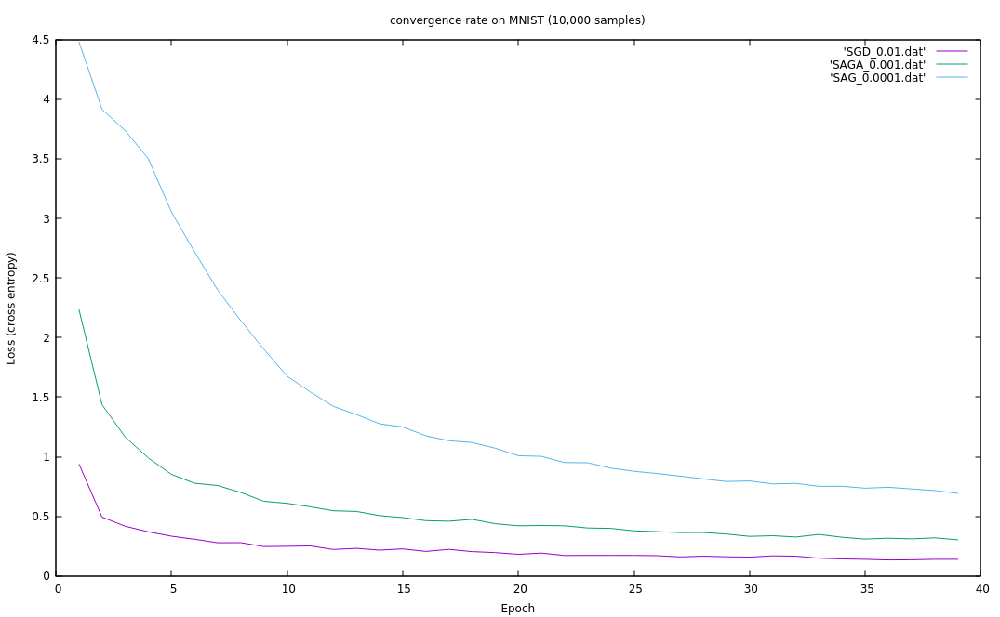

# Implementing SAGA and testing it vs SGD
The aim of this page is to discuss about the implementation and the interest of a variant of SGD, called SAGA (from  [Lacoste-Julien et al., 2014](http://papers.nips.cc/paper/5258-saga-a-fast-incremental-gradient-method-with-support-for-non-strongly-convex-composite-objectives.pdf) ). 
It is very similar to Stochastic Average Gradient (SAG) but has better theoretical convergence rates according to its creators.
You can check the whole implementation in `SAGA_nnet.hpp`.

- **I- [ Intuition behind SAGA ](#intuition)**

- **II- [ Implementing SAGA on libtorch ](#implementing)**
	- 1- [Algorithm ](#algorithm)
	- 2- [Gradients storage issue ](#storage)
	- 3- [Initializing gradients ](#init)
	- 4- [SAGA update ](#update)

- **III- [ SAGA vs SGD on MNIST ](#results)**

- **IV- [Conclusion : SAGA is not designed for neural networks ](#conclusion)**

<a name="intuition"></a>
## I- Intuition behind SAGA

Stochastic gradient descent is the most popular way to update parameters in a deep learning algorithm task. Let say we have a weight W to update with gradient of J w.r.t W, and a learning rate alpha. At the (k+1)th iteration we choose an individual i of the dataset randomly, and SGD update is given by :


Even if this gradient descent algorithm is great, one can wonder which impact an individual X that diverges from the rest of the dataset can have on our parameters. Of course, thanks to a small learning rate, our estimator will converge anyway, but it might not take the shortest path to the minimum :


A smoother approach to update our parameters could involve an **average** of all the gradients computed on each individual. But unlike a simple gradient descent, this algorithm would also update the gradient of an individual (randomly chosen) at each iteration, and use it in the update equation. This is what SAGA algorithm attempts to do. 

To describe this algorithm on a simple weight W, we will denote the i th gradient (out of n) linked to the i th individual, at iteration k by :


At the (k+1)th iteration, denoting by i an individual chosen randomly, SAGA algorithm consists in the following update : 


As we can see, it clearly involves three quantities :
	- the new gradient of individual i
	- the former gradient of individual i
	- the average gradient of the n individuals

The objective of SAGA is to reduce variance by attaching less importance on each individual variation of gradients. It is a variant of the Stochastic Average Gradient (SAG, you can check [Le Roux et al., 2014](https://arxiv.org/pdf/1309.2388.pdf) for more information.). SAG has a reduced variance compared to SAGA, but is biased. Here is the relatively similar implementation of SAG :


Basically, each individual changes has less impact on the algorithm (this is why the variance is smaller) but it makes the assumption that the dataset is realitvely homogeneous, which is not obvious nor right in some cases.

<a name="implementing"></a>
## II- Implementing SAGA on libtorch 

While the idea behind SAGA is quite simple (see Algorithm), the implementation of the algorithm is not simple in the case of neural network. First, the complexity of the update algorithm is greater than the SGD one as we have to update an entire table to compute the average of gradients (see SAGA update).
Then, this table of gradients is quite big when it comes to neural network. (see Gradient storage issue).

<a name="algorithm"></a>
### 1- Algorithm


________________________________________

- Initialization :


- Iteration :


________________________________________

<a name="storage"></a>
### 1- Gradients storage issue

The first issue we encountered is due to the huge amount we have to store when it comes to neural networks. Indeed, if we want to run lines 2. and 3. of the algorithm above, we
have to store the n gradients. If we use a similar architecture to the one in the [previous project](https://github.com/Djeeb/stage_DL/tree/master/projects_pytorch/nnet_from_scratch), remembering that MNIST train dataset length is 60,000 we have to store :
	
- 60,000 tensors of shape 64 x 784 to update W1
- 60,000 tensors of shape 64 to update b1
- 60,000 tensors of shape 10 x 64 to update W2
- 60,000 tensors of shape 10  to update b2

Remembering a `double` is 8-bit long, if we use this dtype, we need around **25 Gb** of CPU/GPU memory to store these gradients. In order to reduce this number, we have two choices :

- Reduce the size of the hidden layer to **16 nodes** (i.e. 7 Gb of memory needed).
- Train the model on a small part of the dataset (10,000 samples). This method could be improved by combining SAGA with batch gradient descent : one can train the model on 10,000 samples with SAGA 
during a certain number of epochs, and then change the training set with another 10,000 samples, etc. Problem : each time, we have to initialize gradients again (see below), i.e. spend 1 epoch per batch doing nothing.

We will use 4 `std::vector` (one for each parameter object) of length 60,000 to store the gradients. This storage method is highly debatable.


<a name="init"></a>
### 3- Initializing gradients

Here is the part of the `nnet` class constructor we're interested in. The idea is to initialize all the vectors at the right dimensions to avoid any shape issue during the update task. note that we will also
store the average of gradients in the last case of the vectors :

```c++
if(optimizer == "SAGA"){
	//Using resize() to define vectors length and avoid any hidden complexity
	SAGA_W1.resize(n_train+1);
	SAGA_b1.resize(n_train+1);
	SAGA_W2.resize(n_train+1);
	SAGA_b2.resize(n_train+1);
	
	//setting tensors at the right dimension
	for(int i=0; i < training_size+1; i++){
		SAGA_W1[i] = torch::zeros({n_hidden,n_input}).to(options_double);
		SAGA_b1[i] = torch::zeros({n_hidden}).to(options_double);
		SAGA_W2[i] = torch::zeros({n_output,n_hidden}).to(options_double);
		SAGA_b2[i] = torch::zeros({n_output}).to(options_double);
	}
}
```

<a name="update"></a>
### 4- SAGA update

One of the trickiest issues with SAGA is : how to compute the first loop ? We decided to implement a safe (but costly !) method that consist in computing a SGD-like algorithm during the first pass 
without updating the parameters. Then, We simply apply the algorithm described above. Note that we need to use `set_data()` and `clone()` methods in order to copy the `grad()` values properly. 

```c++
void nnet::update_SAGA(int epoch,int i){
	//Init with SGD
	if(epoch==0){
		//updating the i-th gradient
		SAGA_W1[i].set_data(this->parameters()[0].grad().clone());
		SAGA_b1[i].set_data(this->parameters()[1].grad().clone());
		SAGA_W2[i].set_data(this->parameters()[2].grad().clone());
		SAGA_b2[i].set_data(this->parameters()[3].grad().clone());
		
		//updating the average of gradients
		SAGA_W1[training_size] += SAGA_W1[i] / double(training_size);
		SAGA_b1[training_size] += SAGA_b1[i] / double(training_size);
		SAGA_W2[training_size] += SAGA_W2[i] / double(training_size);
		SAGA_b2[training_size] += SAGA_b2[i] / double(training_size);			
	}
	//SAGA algorithm
	else{
		//updating parameters with SAGA algorithm
		this->parameters()[0].set_data(this->parameters()[0] - learning_rate * ( this->parameters()[0].grad() - SAGA_W1[i] + SAGA_W1[training_size] ) );
		this->parameters()[1].set_data(this->parameters()[1] - learning_rate * ( this->parameters()[1].grad() - SAGA_b1[i] + SAGA_b1[training_size] ) );
		this->parameters()[2].set_data(this->parameters()[2] - learning_rate * ( this->parameters()[2].grad() - SAGA_W2[i] + SAGA_W2[training_size] ) );
		this->parameters()[3].set_data(this->parameters()[3] - learning_rate * ( this->parameters()[3].grad() - SAGA_b2[i] + SAGA_b2[training_size] ) );
		
		//updating the average of gradients
		SAGA_W1[training_size] += ( this->parameters()[0].grad() - SAGA_W1[i] ) / double(training_size);
		SAGA_b1[training_size] += ( this->parameters()[1].grad() - SAGA_b1[i] ) / double(training_size);
		SAGA_W2[training_size] += ( this->parameters()[2].grad() - SAGA_W2[i] ) / double(training_size);
		SAGA_b2[training_size] += ( this->parameters()[3].grad() - SAGA_b2[i] ) / double(training_size);
		
		//updating the i-th gradient
		SAGA_W1[i].set_data(this->parameters()[0].grad().clone());
		SAGA_b1[i].set_data(this->parameters()[1].grad().clone());
		SAGA_W2[i].set_data(this->parameters()[2].grad().clone());
		SAGA_b2[i].set_data(this->parameters()[3].grad().clone());				
	}
}
```

As you can see in `SAGA_nnet.hpp`, SAG algorithm is quite similar and requires less operations for the computer as we can update `SAGA_W1[training_size]` before updating the parameters.

<a name="results"></a>
## III- SAGA vs SAG vs SGD on MNIST

First, we made SAGA compete with SAG and SGD with an additional number of epochs for SAG and SAGA (the first one is only a gradient initialization in these cases) :

| Algorithm     | training size | epochs | learning rate  | time (sec) | Accuracy (test set)  |
| ------------- | ------------- | ---------- | ---------- | ---------- | ---------- |
| SAGA          | 10,000        | 4 (3)      | 0.001         | 65.5 (51.1)| 87.5%      |
| SAG          | 10,000         | 4 (3)      | 0.001         | 46.3 (31.9)| 78.1%      |
| **SGD**           | **10,000**        |    **3**    | **0.01**        | **39.6**   	   | **90.2%**		|
| SAGA          | 10,000        | 7 (6)      | 0.001         | 104.9 (90.2)| 90.8%      |
| SAG         | 10,000        | 7 (6)      | 0.001         | 98.2 (83.7)| 73.1%      |
| **SGD**           | **10,000**        |    **6**    | **0.01**        | **69.8**   	   | **95.9%**		|




In this particular task, SAGA did not prove that it has faster convergence rates than SGD but was slightly faster than SAG. 
Both table and convergence graph show that SGD outperformed SAGA and SAG in terms of convergence.


*Note : due to the high cache storage volume needed for SAGA, all models have been trained on GPU*

<a name="conclusion"></a>
## IV- Conclusion : SAGA is not designed for neural networks

The main reason for that is this gradient storage that is a real problem for deep neural networks architectures and big datasets. Beside that, results on MNIST showed us
that in this particular case, SAGA is not faster than SAG. However would be interesting to dig into this family of variance reduced gradients, especially SVRG
(Stochastic Variance Reduced Gradient) mentionned in SAGA research paper. Indeed, SVRG creators said in [Rie Johnson et al., 2013](https://papers.nips.cc/paper/4937-accelerating-stochastic-gradient-descent-using-predictive-variance-reduction.pdf) :
> *"Unlike SDCA or SAG, our method does not require the storage of gradients, and thus is more easily applicable to complex problems such as
> some structured prediction problems and neural network learning."*
