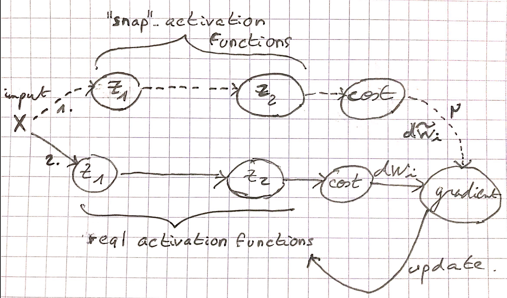

# Implementing SVRG to approximate simple functions
Following our exploration of variants of SGD algorithm (check our previous analysis of [SAGA](https://github.com/Djeeb/stage_DL/tree/master/projects_pytorch/SAGA_nnet) algorithm),
we decided to dig into the promising **Stochastic Variance Reduced Gradient** algorithm from [R. Johnson et al., 2013](https://papers.nips.cc/paper/4937-accelerating-stochastic-gradient-descent-using-predictive-variance-reduction.pdf).
It is directly inspired from SDCA and SAG, but unlike SAG, it doesn't involve full gradients storage. Researchers say it is actually easily applicable for neural network learning.
We want to compare convergence rate to SGD algorithm on a neural network structure. 
You can check the whole implementation in `SVRG_nnet.hpp`.

Unlike previous experiments, our numerical tests will be based on a simple function approximation. 

- **I- [ Intuition behind SVRG ](#intuition)**

- **II- [ Implementing SVRG on libtorch ](#implementing)**
	- 1- [Algorithm ](#algorithm)
	- 2- [How to compute and store the gradient of W tild ?](#gradient)
	
- **III- [ Numerical application ](#numerical)**
	- 1- [Approximation of sin(x) ](#sin)
	- 2- [Approximation of the euclidean norm](#euclidean)

<a name="intuition"></a>
## I- Intuition behind SVRG

As usual, we denote the gradient of J w.r.t a parameter W at iteration (k) on the ith sample by : 


At iteration (k), SVRG consists in picking i randomly among the n samples and update the parameter W as follows : 

 

where W tilde denotes a *snapshot* of the parameter taken at a certain iteration index. Typically, this W is stored every 2n or 5n (n is the number of samples).

Again, the idea is to reduce the variance induced by SDG. Indeed, if SGD algorithm converges to classical gradient descent in expectation, 
the variance of random sampling make the convergence rate much lower, as we have to choose a small learning rate or make it decrease at each iteration.

The solution proposed by SVRG is to use a fixed and larger learning rate in the spirit of SAG ([Le Roux et al., 2012](https://arxiv.org/pdf/1202.6258.pdf)) without using any gradients storage.
In addition, the convergence theories behind SVRG work even in a nonconvex learning task. Thus, it is specially designed for neural networks. 

<a name="implementing"></a>
## II- Implementing SVRG on libtorch

<a name="algorithm"></a>
### 1- Algorithm

SVRG algorithm requires to compute 2 parameters : the *snapshot* one, and the real one. The snapshot one, denoted by W tild, must be updated each m iterations. 

________________________________________


________________________________________

<a name="gradient"></a>
### 2- How to compute and store the gradient of W tild ?

What is complicated with SVRG is to store a snapshot of W every `m*n` iterations (we tried with `m=2` and `m=5` as suggested in the paper) in order to compute the gradient of an individual i at each iteration.
We also have to compute the average of gradients w.r.t W tild whenever it changes. 

Imagine we have a neural network with 2 activation functions. We want to be able to compute both "real" parameter gradient and also "snapshot" gradient at each iteration. Here is a drawing of what we want to implement in c++ : 



Our strategy will consist in :

- 1. computing a forward / back propagation with snapshot parameters and store dWi, but without updating any weight.
- 2. computing a forward / back propagation with real parameters and update them with SVRG method thanks to mu and dWi.
	

#### **Initialization**

We decided to materialize the snapshot activation functions by two additional `torch::nn::Linear` modules, and initialize them with the real parameters. We also use the boolean
`is_snapshot` that will help us switching from the real module to the snapshot one, and inversely :

```c++
//initializing modules and setting parameters equal to the real one. 
z1_snapshot = register_module("z1_snapshot", torch::nn::Linear(n_input,n_hidden));
z2_snapshot = register_module("z2_snapshot", torch::nn::Linear(n_hidden,n_output));
this->parameters()[4].set_data(this->parameters()[0].clone());
this->parameters()[6].set_data(this->parameters()[2].clone());	

//initializing average of gradients w.r.t snapshot parameters
mu_W1 = torch::zeros({n_hidden,n_input}).to(options_double);
mu_b1 = torch::zeros({n_hidden}).to(options_double);
mu_W2 = torch::zeros({n_output,n_hidden}).to(options_double);
mu_b2 = torch::zeros({n_output}).to(options_double);
	
//boolean helper to switch between real/snapshot modules
is_snapshot = true;
```

#### **Compute the average of gradients**

In order to compute the average of gradients w.r.t the snapshot W tild, we have to create a special loop every `m*n` iterations, thanks to a bool variable `is_mu` : 
during `n` iterations, we compute this average of gradients. 
At the last iteration, we get out of the loop and reinitilalize the iteration number in order to pass through the training set `m` more times and compute an actual gradient descent :

```c++
if(is_mu){
	//compute average of gradients w.r.t W tild. 
	mu_W1 += this->parameters()[4].grad().clone() / double(training_size);
	mu_b1 += this->parameters()[5].grad().clone() / double(training_size);
	mu_W2 += this->parameters()[6].grad().clone() / double(training_size);
	mu_b2 += this->parameters()[7].grad().clone() / double(training_size);

	//get out of the loop
	if(i==training_size-1){
		i = -1;
		is_mu = false;
	}
}
```
#### **Forward propagation**

Now we have to change the forward propagation in order to pass to the good modules regarding the bool `is_snapshot`. Also note that we use two `torch::tanh()*1.2` activation functions
that actually are useful for approximating sin(x) (see numerical application) :

```c++
torch::Tensor nnet::forward( torch::Tensor & X ){

//Snapshot forward
if(is_snapshot){
	opt.zero_grad();
	X = z1_snapshot->forward(X);
	X = torch::tanh(X)*1.2;
	X = z2_snapshot->forward(X);
	X = torch::tanh(X)*1.2;		
}

//Real forward
else{
	X = z1->forward(X);
	X = torch::tanh(X)*1.2;
	X = z2->forward(X);
	X = torch::tanh(X)*1.2;
}
		
return X;
}
```

#### **Update**

We have to deal with several cases :

- when we compute the snapshot parameters gradients : we don't do anything beside reducing `i` by 1 and set `is_snapshot` to `false` to prepare real pass. 
- when we compute the real parameters gradients : we apply SVRG formula and set `is_snapshot` to `true`. In addition, if we're at the end of the training_set :
	- if we didn't finish all the passes, we increment m and reinitialize `i`.
	- if we already did all the passes, we set W tild to the real current parameters, set mu to 0, and `is_mu` to `true` in order to prepare the average of gradients calculation. 

Here is the code :

```c++
//When it's snapshot parameters turn : we don't update anything
if(is_snapshot==true){
	is_snapshot = false;
	i--;
}

//When it's real parameters turn : we update parameters with SVRG formula
else{
	this->parameters()[0].set_data(this->parameters()[0].clone() - learning_rate * ( this->parameters()[0].grad().clone() - this->parameters()[4].grad().clone() + mu_W1 ) );
	this->parameters()[1].set_data(this->parameters()[1].clone() - learning_rate * ( this->parameters()[1].grad().clone() - this->parameters()[5].grad().clone() + mu_b1 ) );
	this->parameters()[2].set_data(this->parameters()[2].clone() - learning_rate * ( this->parameters()[2].grad().clone() - this->parameters()[6].grad().clone() + mu_W2 ) );
	this->parameters()[3].set_data(this->parameters()[3].clone() - learning_rate * ( this->parameters()[3].grad().clone() - this->parameters()[7].grad().clone() + mu_b2 ) );			
	is_snapshot = true;
}

//deal with the end of the training set pass
if(i==training_size-1){

	//Can be m<5
	if(m<2){
		i = -1;
		m++;
		}
	
	//Updating W tild and prepare the next average of gradients computation
	else{
		this->parameters()[4].set_data( this->parameters()[0].clone() );
		this->parameters()[5].set_data( this->parameters()[1].clone() );
		this->parameters()[6].set_data( this->parameters()[2].clone() );
		this->parameters()[7].set_data( this->parameters()[3].clone() );
		
		mu_W1 -= mu_W1;
		mu_b1 -= mu_b1;
		mu_W2 -= mu_W2;
		mu_b2 -= mu_b2;
		
		m = 1;
		is_mu = true;
	}
}
```

<a name="numerical"></a>
## III- Numerical application

We will try SVRG, SGD, SAGA and SAG on a function approximation problem. More precisely, we will try to approximate :


We will use the convergence rate of the loss function (MSE for all the approximations). We will also use MSE loss value for the test set and plot the approximation to see if it fits with sin(x) curve.

<a name="sin"></a>
### 1- Approximation of sin(x)

Here are the information of the training and the test sets : 


#### **Neural network architecture used**
We use a one-hidden fully connected neural network : 
	- one node for the input - 20 nodes on the hidden layer - 1 node for the output
	- 1st activation function : relu
	- 2nd activation function : tanh() * 1.2 in order to fit with the highest and lowest values of sin(x)


<a name="euclidean"></a>
### 2- Approximation of the euclidean norm
