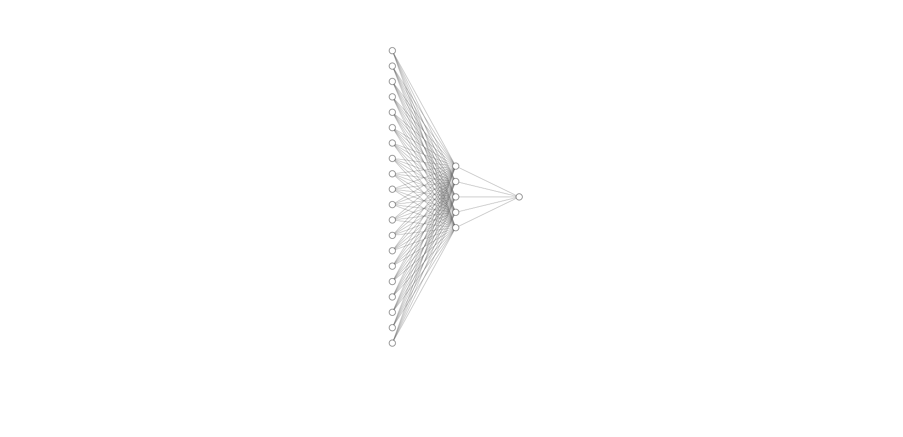

# Implementing a neural net from scratch using libtorch data structure (on MNIST)
The aim of this section is to describe a step-by-step implementation of a 1-layer fully-connected neural network using SGD,  on both mathematical and coding side. It will be trained on MNIST database for illustration. You can check `nnet_from_scratch.hpp` to look at the whole code and see how exactly `nnet` class is implemented.

- Neural network model choice
- Implementing our neural network


## Neural network model choice

Will we use the most simple neural network architecture, a 1-hidden layer fully connected neural network which could look like this : 



here are the main parameters of our model :
- input layer size : 784 
- hidden layer size : 64
- output layer size : 10
- first activation function : sigmoid
- second activation function : sigmoid
- cost function used : mean squared error
- update algorithm used : [stochastic gradient descent](https://en.wikipedia.org/wiki/Stochastic_gradient_descent)  

## Implementing our neural network

### 1- Parameters initialization 
Regarding to our model, we should initialize 4 objects : two couples of weight/bias matrices. The first one would be used to pass our samples from the input layer (size : 784) to the hidden layer (size : 64). The second one would be used to pass our sample from the hidden layer to the output layer (size : 10). The simplest and most logical idea for intializing them is to use an element-wise *standard normal distribution* for weights and to set bias to a **zero-vector** : 
    

 
 

 
 

 
 

 
 
Hence, a simple way to code initialization method for our nnet class is to use `torch::randn` and `torch::zeros` and to set their dtype to `torch::kFloat64` for homogeneity : 
```c++
nnet::nnet(int n_i,int n_h,int n_o, double alpha): n_input(n_i), n_hidden(n_h), n_output(n_o), learning_rate(alpha) {
	//First couple
	W1 = torch::randn({n_hidden,n_input}, torch::dtype(torch::kFloat64));
	b1 = torch::zeros({n_hidden,1}, torch::dtype(torch::kFloat64));

	//Second couple
	W2 = torch::randn({n_output,n_hidden}, torch::dtype(torch::kFloat64));
	b2 = torch::zeros({n_output,1}, torch::dtype(torch::kFloat64));
}
```

### 2- Forward propagation
Next step is to implement forward propagation, i.e. evaluation of samples by the neural network. If our neural network was a black-box represented by a function, our foward propagation would ideally look like :


It follows that we can decompose our forward propagation in two main steps. 
- First step, from 784 features to 64 features, using a **sigmoid activation function** :


- Second step, from 64 features to 10 features, using a **sigmoid activation function** :


Here is a simple implementation of the forward method, using `torch::tensor::mm` and `torch::sigmoid` methods :
```c++
void nnet::forward(const torch::Tensor & X){
	//input_layer -> hidden_layer
	z1 = W1.mm(X) + b1;
	g1 = torch::sigmoid(z1);
	
	//hidden_layer -> output
	z2 = W2.mm(g1) + b2;
	g2 = torch::sigmoid(z2);
}
```

### 3- Cost function used
Choice of the cost function J is a key element in neural network modeling as it directly impact the first gradient calculation (in our case, dJ/dg2) as we will see in next section. As the cost function should represent how "bad" or how "well" the learning task is converging to an estimator, there is a plenty of choice. 

#### - MSE
The most common one is the [Mean squared error](https://en.wikipedia.org/wiki/Mean_squared_error). Indexing columns of matrices by i and number of samples by n, we have this equation for MSE :


Implementing cost computing is not necessarily for the neural network in itself but it is a good way to see how well your model is training during the learning phase. We use the methods `sum()` that sums all matrix coefficients to output a single coefficient tensor, and `item<double>()` to convert the coefficient to a `double` :

```c++
void nnet::compute_cost(torch::Tensor & Y){
	J += ((g2-Y)*(g2-Y)).sum().item<double>();
}
```

#### - Cross entropy loss

Another option is given by the [Cross entropy loss](https://towardsdatascience.com/understanding-binary-cross-entropy-log-loss-a-visual-explanation-a3ac6025181a), a more refined loss function that has the advantage to strongly penalize the model if the estimation differs from the actual answer : 


Again, the implementation is quite simple with the `torch::log` function :

```c++
void nnet::compute_cost(torch::Tensor & Y){
	J += (- (Y * torch::log(g2) + (1-Y) * torch::log(1-g2))).sum().item<double>();
}
```

To end this section, we use an auxiliary function to both display and reset the cost.  Also note that we use the training dataset size to scale the cost and harmonize the results :

```c++
double nnet::reset_cost(int training_size) { 
	double x = J/double(training_size);
	J = 0.;
	return x;}
```

### 4- Backward propagation
#### - Mathematical step-by-step method
This is the trickiest part of neural network implementation as it requires a bit of calculus and linear algebra skills to compute the gradients. As our goal is to slightly change weights and biases with their slope regarding the cost function J, we have to use the [chain rule](https://en.wikipedia.org/wiki/Chain_rule) and calculate intermediary values to compute dJ w.r.t W1, W2, b1, and b2. Here is the step-by-step mathematical path **for MSE** :

First, we can write our cost function regarding to G2 (our last activation function) in a multivariable way, calling **n** the number of examples (batch size) used to compute the forward propagation : 


Then we can easily compute the jacobian matrix of J w.r.t to G2 : 


Remembering the derivative of the sigmoid function of a single variable u : 


We have this equation for dG2 w.r.t. Z2, where * denotes the element-wise product : 


As G2 and Z2 have the same dimensions, we can apply the chain rule using the element-wise product to compute dJ w.r.t Z2 :


Now we can compute dJ w.r.t dW2 by first computing dZ2 w.r.t W2 using differentiation. If z2 can be viewed as a function we can compute the differentiation with the classical matrix inner product :


And then :


By checking dimensions of our gradients, we can finally use the chain rule to compute dJ w.r.t dW2 :


The role of bias in Z2 is slightly different from an actual matrix addition, as the dimensions don't match. It consists in adding the bias on each of the n columns of W2 x G1, Therefore : 


And by the chain rule, we have dJ w.r.t db2 :


The same kind of calculus for W1 and b1 leads to :


#### - Using *autograd* from libtorch


### 5- Parameters update

### 6- Model evaluation

