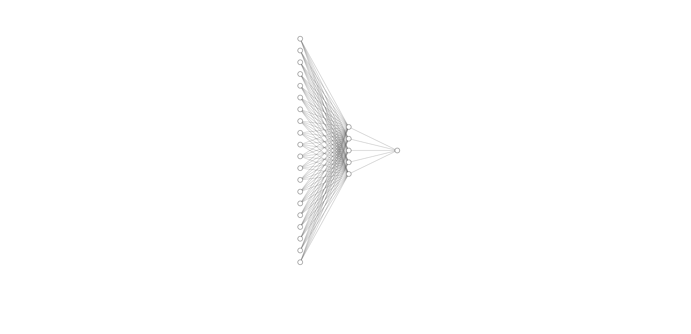

# Implementing a neural net from scratch using libtorch data structure (on MNIST)
The aim of this section is to describe a step-by-step implementation of a 1-layer fully-connected neural network using SGD,  on both mathematical and coding side. It will be trained on MNIST database for illustration. You can check `nnet_from_scratch.hpp` to look at the whole code and see how exactly `nnet` class is implemented.

- **I- [ Neural network model choice ](#model)**

- **II- [ Implementing our neural network. ](#implementing)**
	- 1- [Parameters initialization ](#initialization)
	- 2- [Forward propagation ](#forward)
	- 3- [Cost function used ](#cost)
	- 4- [Backward propagation ](#backward)
	- 5- [Parameters update ](#update)
	- 6- [Model evaluation](#evaluation)

- **III- [ Results ](#results)**

<a name="model"></a>
## I- Neural network model choice

Will we use the most simple neural network architecture, a 1-hidden layer fully connected neural network which could look like this : 



here are the main parameters of our model :
- input layer size : 784 
- hidden layer size : 64
- output layer size : 10
- first activation function : sigmoid
- second activation function : sigmoid
- cost function used : mean squared error // cross entropy loss
- update algorithm used : [stochastic gradient descent](https://en.wikipedia.org/wiki/Stochastic_gradient_descent)  

<a name="implementing"></a>
## II- Implementing our neural network

<a name="initialization"></a>
### 1- Parameters initialization 
Regarding to our model, we should initialize 4 objects : two couples of weight/bias matrices. The first one would be used to pass our samples from the input layer (size : 784) to the hidden layer (size : 64). The second one would be used to pass our sample from the hidden layer to the output layer (size : 10). The simplest and most logical idea for intializing them is to use an element-wise *standard normal distribution* for weights and to set bias to a **zero-vector** : 
    

 
 

 
 

 
 

 
 
Hence, a simple way to code initialization method for our nnet class is to use `torch::randn` and `torch::zeros` and to set their dtype to `torch::kFloat64` for homogeneity : 
```c++
nnet::nnet(int n_i,int n_h,int n_o, double alpha): n_input(n_i), n_hidden(n_h), n_output(n_o), learning_rate(alpha) {
	//First couple
	W1 = torch::randn({n_hidden,n_input}, torch::dtype(torch::kFloat64));
	b1 = torch::zeros({n_hidden,1}, torch::dtype(torch::kFloat64));

	//Second couple
	W2 = torch::randn({n_output,n_hidden}, torch::dtype(torch::kFloat64));
	b2 = torch::zeros({n_output,1}, torch::dtype(torch::kFloat64));
}
```
<a name="forward"></a>
### 2- Forward propagation
Next step is to implement forward propagation, i.e. evaluation of samples by the neural network. If our neural network was a black-box represented by a function, our foward propagation would ideally look like :


It follows that we can decompose our forward propagation in two main steps. 
- First step, from 784 features to 64 features, using a **sigmoid activation function** :


- Second step, from 64 features to 10 features, using a **sigmoid activation function** :


Here is a simple implementation of the forward method, using `torch::tensor::mm` and `torch::sigmoid` methods :
```c++
void nnet::forward(const torch::Tensor & X){
	//input_layer -> hidden_layer
	z1 = W1.mm(X) + b1;
	g1 = torch::sigmoid(z1);
	
	//hidden_layer -> output
	z2 = W2.mm(g1) + b2;
	g2 = torch::sigmoid(z2);
}
```
<a name="cost"></a>
### 3- Cost function used
Choice of the cost function J is a key element in neural network modeling as it directly impact the first gradient calculation (in our case, dJ/dg2) as we will see in next section. As the cost function should represent how "bad" or how "well" the learning task is converging to an estimator, there is a plenty of choice. 

#### - MSE
The most common one is the [Mean squared error](https://en.wikipedia.org/wiki/Mean_squared_error). Indexing columns of matrices by i and number of samples by n, we have this equation for MSE :


Implementing cost computing is not necessarily for the neural network in itself but it is a good way to see how well your model is training during the learning phase. We use the methods `sum()` that sums all matrix coefficients to output a single coefficient tensor. Then we divide by `batch_size`, i.e. the number of examples used during the forward propagation :

```c++
void nnet::compute_cost(torch::Tensor & Y){
	J += ((g2-Y)*(g2-Y)).sum() / double(batch_size);
}
```

#### - Cross entropy loss

Another option is given by the [Cross entropy loss](https://towardsdatascience.com/understanding-binary-cross-entropy-log-loss-a-visual-explanation-a3ac6025181a), a more refined loss function that has the advantage to strongly penalize the model if the estimation differs from the actual answer : 


Again, the implementation is quite simple with the `torch::log` function :

```c++
void nnet::compute_cost(torch::Tensor & Y){
	J += (- (Y * torch::log(g2) + (1-Y) * torch::log(1-g2))).sum() / double(batch_size);
}
```

To end this section, we use an auxiliary function to both display and reset the cost. We use `item<double>()` to convert the coefficient to a `double` and the `training_size` to scale the cost and harmonize the results :

```c++
double nnet::reset_cost(int training_size) { 
	double x = J.item<double>() * double(batch_size) / double(training_size);
	J = 0.;
	return x;}
```
<a name="backward"></a>
### 4- Backward propagation
#### - Mathematical step-by-step method
This is the trickiest part of neural network implementation as it requires a bit of calculus and linear algebra skills to compute the gradients. As our goal is to slightly change weights and biases with their slope regarding the cost function J, we have to use the [chain rule](https://en.wikipedia.org/wiki/Chain_rule) and calculate intermediary values. Our goal is to find :


To facilitate gradient calculus, we will set n = 1 and use coordinates before generalizing to matrices. Our cost function is now a simple multivariable function from R10 to R :


Then we can easily compute the gradient of J w.r.t G2 : 


Remembering the derivative of the sigmoid function of a single variable u : 


We have this equation for dG2 w.r.t. Z2 : 


And by using the chain rule we obtain the gradient of J w.r.t. Z2 : 


Same method is applied for dJ w.r.t W2. Remembering how we compute the linear function Z2 without the bias : 


Derivative is quite easy to calculate and we can apply the chain rule : 


Finally, we can scale it to matrices to facilitate the further coding implementation ( the dot denotes matrix multiplication and the star element-wise multiplication) : 


For the bias b2, the same method can be applied : 


And leads to :


Let's compute the gradients for W1 and b1 with the same method : 


And the matrix-friendly formula leads to :


Here is the code to implement these formula with the computation of intermerdiary values. Note that we have to adapt the formula a little bit for the biases as we have to sum all the columns : 

```c++
void nnet::backward(const torch::Tensor & X,const torch::Tensor & Y){

	// dJ/dg2
	//dg2 = -((Y / g2) - ((1-Y) / (1-g2)))/double(batch_size); ----> use this function if you want to use the cross entropy function
	dg2 = 2*(g2-Y)/double(batch_size);

	// dJ/dz2
	dz2 = dg2 * g2 * (1 - g2);
	
	// dJ/dW2
	dW2 = dz2.mm(g1.transpose(0,1));
	
	// dJ/db2
	dz2 = dz2.transpose(0,1);
	db2 = dz2[0].reshape({n_output,1});
	for(long i = 1; i < batch_size; i++){
		db2 += dz2[i].reshape({n_output,1});
	}
	dz2 = dz2.transpose(0,1);
	
	// dJ/dg1
	dg1 = (W2.transpose(0,1)).mm(dz2);
	
	// dJ/dz1
	dz1 = dg1 * g1 * (1 - g1);
	
	// dJ/dW1 
	dW1 = dz1.mm(X.transpose(0,1));
	
	// dJ/db1
	dz1 = dz1.transpose(0,1);
	db1 = dz1[0].reshape({n_hidden,1});
	for(long i = 1; i < batch_size; i++){
		db1 += dz1[i].reshape({n_hidden,1});
	}
	dz1 = dz1.transpose(0,1);

}
```
<a name="update"></a>
### 5- Parameters update

#### - Classical update

As we are using SGD algorithm, updating parameters is quite easy. It only consists in removing an small part of the gradient parameters (i.e. multiplicated by the `learning_rate` denoted by alpha) to each of them. An example for W2 :


The code is quite simple :

```c++
void nnet::update(){

	W2 = W2 - dW2 * learning_rate;
	b2 = b2 - db2 * learning_rate;
	
	W1 = W1 - dW1 * learning_rate;
	b1 = b1 - db1 * learning_rate;

}
```

#### - With momentum

A smart way to avoid exploding and vanishing gradient descent is to give some "memory" to the gradient, by doing a weighted average between the new and the former value. It is called [Momentum](https://towardsdatascience.com/stochastic-gradient-descent-with-momentum-a84097641a5d). If beta is in 0 and 1 (1 corresponding to the classical gradient descent), here is the example for W2 :


And the code is now given by : 

```c++
void nnet::update(){

	//Computing momentum with beta = 0.9
	VdW2 = 0.9 * VdW2 + 0.1 * dW2;
	Vdb2 = 0.9 * Vdb2 + 0.1 * db2;
	
	VdW1 = 0.9 * VdW1 + 0.1 * dW1;
	Vdb1 = 0.9 * Vdb1 + 0.1 * db1;
	
	//Updating parameters
	W2 = W2 - VdW2 * learning_rate;
	b2 = b2 - Vdb2 * learning_rate;
	
	W1 = W1 - VdW1 * learning_rate;
	b1 = b1 - Vdb1 * learning_rate;

}
```
<a name="evaluation"></a>
### 6- Model evaluation
Among the multiple ways that exist to evaluate a model, we chose to calculate the error rate regarding a test set. Therefore we implemented two auxiliary functions to help to compute this error rate.

- First we map the result to the correct label using `argmax()` method :

```c++
torch::Tensor nnet::predict(const torch::Tensor & X_test){

	this->forward(X_test);
	return g2.argmax(0).to(torch::TensorOptions().dtype(torch::kInt64));
	
}
```

- Then we simply calculate the error rate by summing the difference between the two one-hot vectors (we couldn't find a way to combine boolean rules with tensors) :

```c++
double error_rate(const torch::Tensor & Y_test, const torch::Tensor & Y_hat){

	return 1 - (at::one_hot(Y_test,10) - at::one_hot(Y_hat,10)).abs().sum().item<double>()/(2.*double(Y_test.size(0)));
	
}
```

<a name="results"></a>
## III- Results
We tried to change `learning_rate`, `batch_size`, and the loss function to see how it affects *time complexity* and *accuracy* on test set : 

| loss function | learning rate | batch_size | epochs     | time (sec) | Accuracy   |
| ------------- | ------------- | ---------- | ---------- | ---------- | ---------- |
| MSE           | 0.1           |     6      | 10         | 54.5	   | 92.9%      |
| MSE           | 0.1           |     600    | 50         | 49.2   	   | 48.1%		|
| MSE           | 0.1           |     60000  | 100	      | 89.9	   | 10.3%		|
| MSE           | 0.01          |     6      | 10         | 55.5	   | 51.3%		|
| MSE           | 0.01          |     600    | 50	      | 46.6	   | 21.0%		|
| MSE           | 0.01          |     60000  | 100		  | 86.9       |  8.6%		|
| **Cross Entropy** | **0.1**       |     **6**  | **10**     | **56.0**   | **95.6%**	|
| Cross Entropy | 0.1           |     600    | 50	      | 43.6	   | 88.6%		|
| Cross Entropy | 0.1           |     60000  | 100	      |  86.0	   | 38.0%		|
| Cross Entropy | 0.01          |     6      | 10	      | 57.3	   | 91.0%		|
| Cross Entropy | 0.01          |     600    | 50	      | 42.0	   | 69.6%		|
| Cross Entropy | 0.01          |     60000  | 100	      | 82.2	   | 14.0%		|

*Note : all the models have been trained on CPU*
